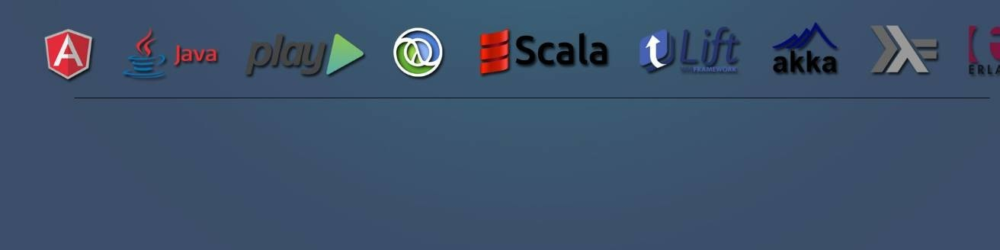

### PROFILE

An organized, detail-oriented, and
conscientious self-starter, able to
strategize and prioritize effectively,
highly skilled, dedicated & result
oriented professional with strong
business perspective to technology,
especially in Product Development
based scenario with 9+ years of
experience in renowned IT
organizations including HCL, IDEMIA
India, Sapient, Knoldus and WE
Software Solutions.

#### Technologies I Love: 

Java, Scala, Cats, Play
Framework, Akka, AkkaHTTP, Kafka, AzureDevOps, AWS, Git, InteliJ Idea, Unix, JavaScript,
Bootstrap, NoSQL (Elasticsearch,
MongoDB), Kibana and Microservice Architecture.

